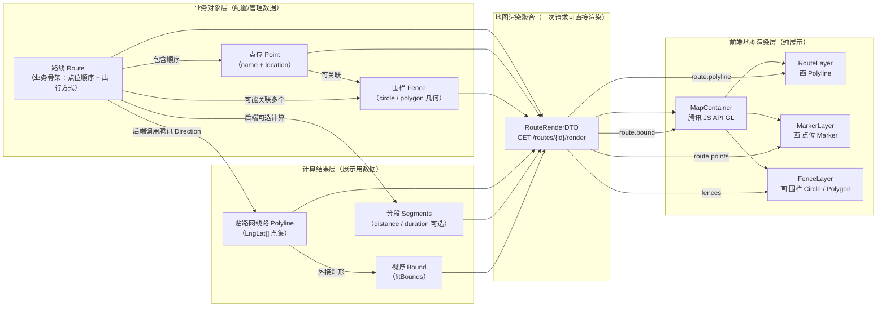

# 地图模块关系图（Route / Point / Fence / Polyline / Render）· v1

> 用途：给前后端快速对齐“对象关系”和“渲染数据流”。  
> 约定：**前端渲染**；**后端计算**；贴路网线路 `polyline` 由后端调用腾讯计算并返回。

---

## 1) 关系图（Mermaid）



---

## 2) 关键结论（口径统一）

### 2.1 “路线”不是点位直线连接
- `Route.points` 只是**业务骨架**（顺序/配置）
- 真正用于地图展示的“路线”，必须是后端返回的：
  - `route.polyline: LngLat[]`（贴路网点集）

### 2.2 围栏是独立几何对象
- `Fence` 以几何形式存在：
  - 圆：`center + radius`
  - 多边形：`points[]`
- 与路线的关系：
  - 可以通过 `point.fenceIds` 绑定（推荐）
  - 或者 route 直接关联 fences（次选）

### 2.3 暂定最合适的的一次渲染接口数据
- `GET /api/routes/{id}/render`
- 返回 `RouteRenderDTO`：
  - `route.polyline`（线路）
  - `route.points`（点位）
  - `fences[]`（围栏）
  - `route.bound`（视野）

---

## 3) 补充总结（定义与关系）

### 3.1 各对象代表什么
- **Route（路线）**：业务配置对象，核心是点位顺序与出行方式，不代表真实可走路线
- **Point（点位）**：真实地点坐标，用于打点与业务配置
- **Fence（围栏）**：空间几何区域（圆/多边形），用于范围展示与判断
- **Render（RouteRenderDTO）**：前端渲染所需的聚合数据包

### 3.2 关系链路
- **业务链路**：Route -> Point（顺序） -> Fence（可关联）
- **渲染链路**：Route + Polyline（后端计算） + Point + Fence => Render（前端直接画）

---

## 4) 渲染数据最小集合（前端只展示）

```json
{
  "route": {
    "id": "route_001",
    "name": "xxx",
    "travelMode": "BICYCLING",
    "bound": { "sw": { "lng": 0, "lat": 0 }, "ne": { "lng": 0, "lat": 0 } },
    "polyline": [{ "lng": 0, "lat": 0 }],
    "points": [
      { "id": "point_001", "name": "本部", "location": { "lng": 0, "lat": 0 }, "fenceIds": ["fence_001"] }
    ]
  },
  "fences": [
    { "id": "fence_001", "name": "本部围栏", "type": "CIRCLE", "center": { "lng": 0, "lat": 0 }, "radius": 200 }
  ]
}
```
